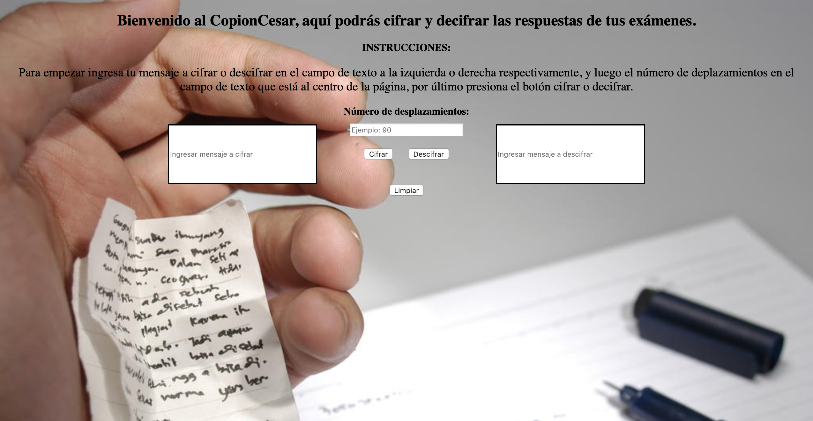

# CopionCesar 

CopionCesar es una aplicación web que permite a los usuarios cifrar y descifrar las respuestas de sus exámenes para colaborar entre ellos.

## Descarga e Instalación

Para descargar e instalar abre tu consola (terminal) en tu directorio de proyectos y ejecuta el siguiente comando:

`git clone https://github.com/consueloleal/SCL009-Cipher`

## Ejecutar Aplicación

Para ejecutar la aplicación desde tu computadora una vez descargada e instalada, debes ingresar a la carpeta del proyecto (`SCL009-Cipher`), y posteriormente a la carpeta `src` y ejecutar con un navegador web el archivo `index.html` haciendo doble clic sobre él.

También, puedes ejecutar directamente la aplicación sin tener que descargarla haciendo clic en este enlace: [CopionCesar](https://consueloleal.github.io/SCL009-Cipher/src/index.html)

## Definición del producto

- ¿Quiénes son los principales usuarios de producto?
Los principales usuarios de la aplicación son estudiantes de enseñanaza básica, media y universitaria.

- Cuáles son los objetivos de estos usuarios en relación con tu producto.
El objetivo principal es obtener mejores calificaciones en los exámenes a través del intercambio de respuestas códificadas, y además, evitar ser descubiertos en caso de sospecha al estar los mensajes encriptados.

- Cómo crees que el producto que estás creando está resolviendo sus problemas.
Resolvemos sus problemas al permitir compartir respuestas de manera más segura.